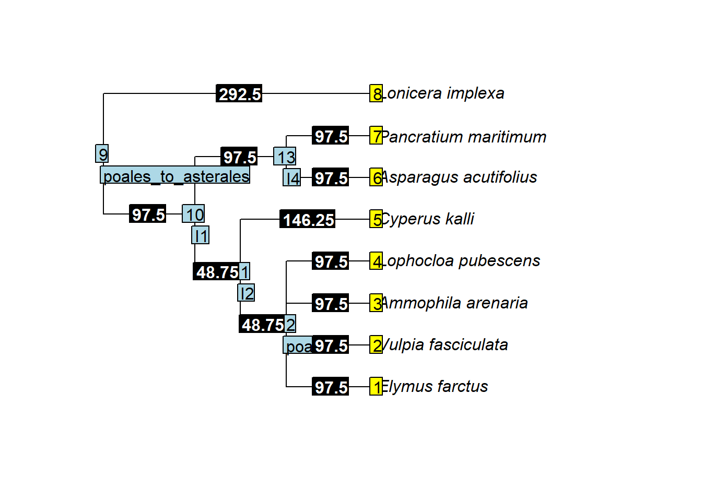
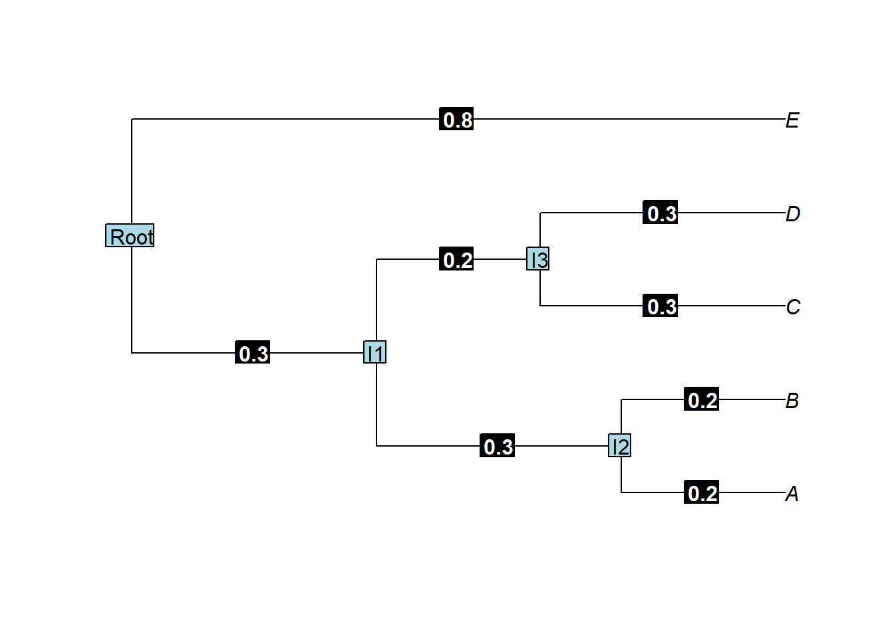

A Quick introudction for chaolab utility
================

<!-- README.md is generated from README.Rmd. Please edit that file -->
overview
========

``` r
library(chaoUtility)
```

`chaoUtility` focuses on some useful tools for chao lab, include:

general functions:[`Boot_p()`](#boot_p) and `checktype()`

phylogeny fucntions:

-[`phylo2phytree()`](#phylo2phytree) : input phylo object([ultrmetric](#examples-ultrametictree) or [non-ultrametric](#examples-non-ultrametictree)), return chaophytree object

-[`phyExpandData()`](#phyexpanddata) : input abundance data, label,chaophytree object, return tibble with abundance or [incidence data](#examples-incidence-simple-data).

-[`phylengthbyT()`](#phylengthbyt) : input vector of ageT, chaophytree object, return matrix with label and new branch.length (default `rootExtend =F` ,if `rootExtend=T and ageT>treeH`, root.length=ageT-treeH), [non ultrametric tree example](#examples-non-ultrametric-tree-by-reference-t)

-`phylo2chaolabphy()`

HOW TO RUN chaoUtility:
-----------------------

The `chaoUtility` package can be downloaded with a standard R installation procedure using the following commands.

``` r
## install the latest version from github
install.packages('devtools')
library(devtools)
install_github('chaolab2019/chaoUtility')
```

Boot\_p
-------

We first describe the main function `Boot_p()` with default arguments:

``` r
Boot_p(x,zero=TRUE,Bootype="One",datatype="abundance")
```

<table style="width:100%;">
<colgroup>
<col width="20%">
<col width="80%">
</colgroup>
<thead>
<tr class="header">
<th align="center">
Argument
</th>
<th align="left">
Description
</th>
</tr>
</thead>
<tbody>
<tr class="odd">
<td align="center">
<code>x</code>
</td>
<td align="left">
a <code>matrix</code>, <code>data.frame</code>, <code>lists</code> of species abundances or incidence data.
</td>
</tr>
<tr class="even">
<td align="center">
<code>zero</code>
</td>
<td align="left">
reserves zero frequency or not. Default is TRUE.
</td>
</tr>
<tr class="odd">
<td align="center">
<code>Bootype</code>
</td>
<td align="left">
<code>character</code> : "One" or "JADE". `Bootype = "One"` or `Bootype = "JADE"` <br> "One": from \#99 2013 Entropy and the species accumulation curve Appendix S2: Estimating species relative abundance. <br>"JADE": from \#107 Unveiling the species-rank abundance distribution by generalizing the Good-Turing sample coverage theory.
</td>
<tr class="even">
<td align="center">
<code>datatype</code>
</td>
<td align="left">
data type of input data: individual-based abundance data (`datatype = "abundance"`), or species by sampling-units incidence frequency (`datatype = "incidence_freq"` or `datatype = "incidence"`),or species by sampling-units incidence matrix (`datatype = "incidence_raw"`).
</td>
</tbody>
</table>
EXAMPLES
--------

``` r
library(chaoUtility)
data(bird)
bird.inc <- bird$inci
bird.abun<- bird$abun
Boot_p(bird$abun, datatype="abundance")
$North.site
           Acanthiza_lineata               Acanthiza_nana 
                 0.000000000                  0.000000000 
           Acanthiza_pusilla Acanthorhynchus_tenuirostris 
                 0.202970297                  0.000000000 
        Alisterus_scapularis             Cacatua_galerita 
                 0.013711189                  0.002085140 
   Cacomantis_flabelliformis     Calyptorhynchus_funereus 
                 0.024505461                  0.019252435 
     Colluricincla_harmonica        Cormobates_leucophaea 
                 0.019252435                  0.054454394 
           Corvus_coronoides          Dacelo_novaeguineae 
                 0.002085140                  0.007808497 
        Eopsaltria_australis               Gerygone_mouki 
                 0.024505461                  0.059405543 
     Leucosarcia_melanoleuca       Lichenostomus_chrysops 
                 0.002085140                  0.000000000 
             Malurus_cyaneus             Malurus_lamberti 
                 0.000000000                  0.000000000 
        Manorina_melanophrys            Meliphaga_lewinii 
                 0.000000000                  0.054454394 
      Menura_novaehollandiae          Monarcha_melanopsis 
                 0.044547402                  0.002085140 
         Neochmia_temporalis           Oriolus_sagittatus 
                 0.000000000                  0.002085140 
       Pachycephala_olivacea      Pachycephala_pectoralis 
                 0.000000000                  0.079207914 
    Pachycephala_rufiventris         Pardalotus_punctatus 
                 0.000000000                  0.074257406 
              Petroica_rosea           Phylidonyris_niger 
                 0.002085140                  0.000000000 
         Platycercus_elegans          Psophodes_olivaceus 
                 0.007808497                  0.034609444 
   Ptilonorhynchus_violaceus          Ptiloris_paradiseus 
                 0.007808497                  0.000000000 
        Rhipidura_albicollis          Rhipidura_rufifrons 
                 0.089108910                  0.039586152 
    Sericornis_citreogularis         Sericornis_frontalis 
                 0.000000000                  0.007808497 
          Strepera_graculina            Zoothera_lunulata 
                 0.013711189                  0.000000000 
         Zosterops_lateralis                              
                 0.079207914                  0.005901447 
                                                          
                 0.005901447                  0.005901447 
                                                          
                 0.005901447                  0.005901447 

$South.site
           Acanthiza_lineata               Acanthiza_nana 
                 0.009205941                  0.058631921 
           Acanthiza_pusilla Acanthorhynchus_tenuirostris 
                 0.100977199                  0.005480418 
        Alisterus_scapularis             Cacatua_galerita 
                 0.001844732                  0.005480418 
   Cacomantis_flabelliformis     Calyptorhynchus_funereus 
                 0.016162296                  0.001844732 
     Colluricincla_harmonica        Cormobates_leucophaea 
                 0.019490072                  0.104234528 
           Corvus_coronoides          Dacelo_novaeguineae 
                 0.000000000                  0.000000000 
        Eopsaltria_australis               Gerygone_mouki 
                 0.016162296                  0.032571812 
     Leucosarcia_melanoleuca       Lichenostomus_chrysops 
                 0.001844732                  0.012754851 
             Malurus_cyaneus             Malurus_lamberti 
                 0.019490072                  0.019490072 
        Manorina_melanophrys            Meliphaga_lewinii 
                 0.029312227                  0.058631921 
      Menura_novaehollandiae          Monarcha_melanopsis 
                 0.016162296                  0.032571812 
         Neochmia_temporalis           Oriolus_sagittatus 
                 0.029312227                  0.000000000 
       Pachycephala_olivacea      Pachycephala_pectoralis 
                 0.005480418                  0.048859923 
    Pachycephala_rufiventris         Pardalotus_punctatus 
                 0.009205941                  0.055374591 
              Petroica_rosea           Phylidonyris_niger 
                 0.001844732                  0.005480418 
         Platycercus_elegans          Psophodes_olivaceus 
                 0.022778664                  0.022778664 
   Ptilonorhynchus_violaceus          Ptiloris_paradiseus 
                 0.005480418                  0.009205941 
        Rhipidura_albicollis          Rhipidura_rufifrons 
                 0.065146580                  0.045602574 
    Sericornis_citreogularis         Sericornis_frontalis 
                 0.005480418                  0.019490072 
          Strepera_graculina            Zoothera_lunulata 
                 0.012754851                  0.001844732 
         Zosterops_lateralis                              
                 0.055374591                  0.005386634 
                                                          
                 0.005386634                  0.005386634 
```

References
----------

-   Chao, A., Wang, Y. T., and Jost, L. (2013). Entropy and the species accumulation curve: a novel estimator of entropy via discovery rates of new species. Methods in Ecology and Evolution, 4, 1091-1110.
-   Chao, A., Hsieh, T. C., Chazdon, R. L., Colwell, R. K., and Gotelli, N. J. (2015). Unveiling the species-rank abundance distribution by generalizing the Good-Turing sample coverage theory. Ecology 96, 1189-1201.

[back](#overview)

phylo2phytree
-------------

### examples ultrametictree

``` r
library(chaoUtility)
data(treesample)
newphy<-phylo2phytree(treesample)

class(newphy)
[1] "chaophytree"
```

``` r
newphy$leaves
       Elymus_farctus    Vulpia_fasciculata    Ammophila_arenaria 
                97.50                 97.50                 97.50 
  Lophocloa_pubescens         Cyperus_kalli Asparagus_acutifolius 
                97.50                146.25                 97.50 
 Pancratium_maritimum      Lonicera_implexa 
                97.50                292.50 

newphy$nodes
poales_to_asterales                  I1                  I2 
               0.00               97.50               48.75 
            poaceae                  I4 
              48.75               97.50 

newphy$phytree
# A tibble: 13 x 6
   parent  node branch.length label                 tgroup node.age
    <int> <int>         <dbl> <chr>                 <chr>     <dbl>
 1     12     1          97.5 Elymus_farctus        leaves      0  
 2     12     2          97.5 Vulpia_fasciculata    leaves      0  
 3     12     3          97.5 Ammophila_arenaria    leaves      0  
 4     12     4          97.5 Lophocloa_pubescens   leaves      0  
 5     11     5         146.  Cyperus_kalli         leaves      0  
 6     13     6          97.5 Asparagus_acutifolius leaves      0  
 7     13     7          97.5 Pancratium_maritimum  leaves      0  
 8      9     8         292.  Lonicera_implexa      leaves      0  
 9      9     9           0   poales_to_asterales   Root      292. 
10      9    10          97.5 I1                    nodes     195  
11     10    11          48.8 I2                    nodes     146. 
12     11    12          48.8 poaceae               nodes      97.5
13     10    13          97.5 I4                    nodes      97.5


newphy$treeH
[1] 292.5
```

``` r
library(ape)
plot(treesample)
tiplabels()
nodelabels()
library(dplyr)
nodetext<-newphy$phytree %>% filter(tgroup!="leaves") %>% pull(label)
nodelabels(text=nodetext,adj=c(0,2.2))
edgelabels(treesample$edge.length, bg="black", col="white", font=2)
```

 [back](#overview)

### examples non ultrametictree

``` r
text<-"(((((((A:4,B:4):6,C:5):8,D:6):3,E:21):10,((F:4,G:12):14,H:8):13):13,((I:5,J:2):30,(K:11,L:11):2):17):4,M:56);"
library(ape)
tree2<-read.tree(text=text)

library(chaoUtility)
tree2.phytree<-phylo2phytree(tree2)

library(dplyr)
nodetext<-tree2.phytree$phytree %>% filter(tgroup!="leaves") %>% pull(label)
plot(tree2)
nodelabels(text=nodetext)
edgelabels(tree2$edge.length, bg="black", col="white", font=2)
```


``` r

tree2.phytree$treeH
[1] 56

as.data.frame(tree2.phytree$phytree)
   parent node branch.length label tgroup node.age
1      20    1             4     A leaves        8
2      20    2             4     B leaves        8
3      19    3             5     C leaves       13
4      18    4             6     D leaves       20
5      17    5            21     E leaves        8
6      22    6             4     F leaves        8
7      22    7            12     G leaves        0
8      21    8             8     H leaves       18
9      24    9             5     I leaves        0
10     24   10             2     J leaves        3
11     25   11            11     K leaves       22
12     25   12            11     L leaves       22
13     14   13            56     M leaves        0
14     14   14             0  Root   Root       56
15     14   15             4    I1  nodes       52
16     15   16            13    I2  nodes       39
17     16   17            10    I3  nodes       29
18     17   18             3    I4  nodes       26
19     18   19             8    I5  nodes       18
20     19   20             6    I6  nodes       12
21     16   21            13    I7  nodes       26
22     21   22            14    I8  nodes       12
23     15   23            17    I9  nodes       35
24     23   24            30   I10  nodes        5
25     23   25             2   I11  nodes       33

tree2.phytree$leaves
 A  B  C  D  E  F  G  H  I  J  K  L  M 
 4  4  5  6 21  4 12  8  5  2 11 11 56 

tree2.phytree$nodes
Root   I1   I2   I3   I4   I5   I6   I7   I8   I9  I10  I11 
   0    4   13   10    3    8    6   13   14   17   30    2 
```

[back](#overview)

phyExpandData
-------------

### EXAMPLES:abundance data

``` r
library(chaoUtility)
data(phybird)
bird.abu <- phybird$abun
bird.lab <- rownames(phybird$abun)
bird.phy <- phybird$chaophytree

bird.abu
                             North.site South.site
Acanthiza_lineata                     0          3
Acanthiza_nana                        0         18
Acanthiza_pusilla                    41         31
Acanthorhynchus_tenuirostris          0          2
Alisterus_scapularis                  3          1
Cacatua_galerita                      1          2
Cacomantis_flabelliformis             5          5
Calyptorhynchus_funereus              4          1
Colluricincla_harmonica               4          6
Cormobates_leucophaea                11         32
Corvus_coronoides                     1          0
Dacelo_novaeguineae                   2          0
Eopsaltria_australis                  5          5
Gerygone_mouki                       12         10
Leucosarcia_melanoleuca               1          1
Lichenostomus_chrysops                0          4
Malurus_cyaneus                       0          6
Malurus_lamberti                      0          6
Manorina_melanophrys                  0          9
Meliphaga_lewinii                    11         18
Menura_novaehollandiae                9          5
Monarcha_melanopsis                   1         10
Neochmia_temporalis                   0          9
Oriolus_sagittatus                    1          0
Pachycephala_olivacea                 0          2
Pachycephala_pectoralis              16         15
Pachycephala_rufiventris              0          3
Pardalotus_punctatus                 15         17
Petroica_rosea                        1          1
Phylidonyris_niger                    0          2
Platycercus_elegans                   2          7
Psophodes_olivaceus                   7          7
Ptilonorhynchus_violaceus             2          2
Ptiloris_paradiseus                   0          3
Rhipidura_albicollis                 18         20
Rhipidura_rufifrons                   8         14
Sericornis_citreogularis              0          2
Sericornis_frontalis                  2          6
Strepera_graculina                    3          4
Zoothera_lunulata                     0          1
Zosterops_lateralis                  16         17

bird.lab
 [1] "Acanthiza_lineata"            "Acanthiza_nana"              
 [3] "Acanthiza_pusilla"            "Acanthorhynchus_tenuirostris"
 [5] "Alisterus_scapularis"         "Cacatua_galerita"            
 [7] "Cacomantis_flabelliformis"    "Calyptorhynchus_funereus"    
 [9] "Colluricincla_harmonica"      "Cormobates_leucophaea"       
[11] "Corvus_coronoides"            "Dacelo_novaeguineae"         
[13] "Eopsaltria_australis"         "Gerygone_mouki"              
[15] "Leucosarcia_melanoleuca"      "Lichenostomus_chrysops"      
[17] "Malurus_cyaneus"              "Malurus_lamberti"            
[19] "Manorina_melanophrys"         "Meliphaga_lewinii"           
[21] "Menura_novaehollandiae"       "Monarcha_melanopsis"         
[23] "Neochmia_temporalis"          "Oriolus_sagittatus"          
[25] "Pachycephala_olivacea"        "Pachycephala_pectoralis"     
[27] "Pachycephala_rufiventris"     "Pardalotus_punctatus"        
[29] "Petroica_rosea"               "Phylidonyris_niger"          
[31] "Platycercus_elegans"          "Psophodes_olivaceus"         
[33] "Ptilonorhynchus_violaceus"    "Ptiloris_paradiseus"         
[35] "Rhipidura_albicollis"         "Rhipidura_rufifrons"         
[37] "Sericornis_citreogularis"     "Sericornis_frontalis"        
[39] "Strepera_graculina"           "Zoothera_lunulata"           
[41] "Zosterops_lateralis"         


phyExpandData(x=bird.abu, labels=bird.lab, phy=bird.phy, datatype="abundance")
$North.site
# A tibble: 81 x 7
   parent  node branch.length label             tgroup node.age branch.abun
    <int> <int>         <dbl> <chr>             <chr>     <dbl>       <int>
 1     46     1          32.0 Alisterus_scapul~ leaves        0           3
 2     46     2          32.0 Platycercus_eleg~ leaves        0           2
 3     47     3          32.1 Cacatua_galerita  leaves        0           1
 4     47     4          32.1 Calyptorhynchus_~ leaves        0           4
 5     48     5          60.6 Menura_novaeholl~ leaves        0           9
 6     50     6          49.8 Ptilonorhynchus_~ leaves        0           2
 7     50     7          49.8 Cormobates_leuco~ leaves        0          11
 8     53     8          14.3 Malurus_lamberti  leaves        0           0
 9     53     9          14.3 Malurus_cyaneus   leaves        0           0
10     55    10          37.0 Pardalotus_punct~ leaves        0          15
# ... with 71 more rows

$South.site
# A tibble: 81 x 7
   parent  node branch.length label             tgroup node.age branch.abun
    <int> <int>         <dbl> <chr>             <chr>     <dbl>       <int>
 1     46     1          32.0 Alisterus_scapul~ leaves        0           1
 2     46     2          32.0 Platycercus_eleg~ leaves        0           7
 3     47     3          32.1 Cacatua_galerita  leaves        0           2
 4     47     4          32.1 Calyptorhynchus_~ leaves        0           1
 5     48     5          60.6 Menura_novaeholl~ leaves        0           5
 6     50     6          49.8 Ptilonorhynchus_~ leaves        0           2
 7     50     7          49.8 Cormobates_leuco~ leaves        0          32
 8     53     8          14.3 Malurus_lamberti  leaves        0           6
 9     53     9          14.3 Malurus_cyaneus   leaves        0           6
10     55    10          37.0 Pardalotus_punct~ leaves        0          17
# ... with 71 more rows
```

[back](#overview)

### examples incidence simple data

``` r
library(chaoUtility)
data(phyincisimple)
data.inc <- phyincisimple$inci.simple.data
data.lab<-rownames(data.inc)
phy.inc<-phyincisimple$tree.simple.phytree


phylotree<-phyincisimple$tree.simple
plot(phylotree)
nodetext<-phy.inc$phytree %>% filter(tgroup!="leaves") %>% pull(label)
nodelabels(text=nodetext)
edgelabels(phylotree$edge.length, bg="black", col="white", font=2)
```



``` r
data.inc
  p1 p2 p3 p4 p5 p6
A  1  1  1  1  0  0
B  1  0  1  0  1  1
C  0  0  1  0  0  1
D  0  1  0  1  1  0
E  1  1  0  1  1  0

dataNtree<-phyExpandData(data.inc, labels=data.lab, phy=phy.inc, datatype="incidence_raw")
as.data.frame(dataNtree)
  parent node branch.length label tgroup node.age branch.abun
1      8    1           0.2     A leaves      0.0           4
2      8    2           0.2     B leaves      0.0           4
3      9    3           0.3     C leaves      0.0           2
4      9    4           0.3     D leaves      0.0           3
5      6    5           0.8     E leaves      0.0           4
6      6    6           1.0  Root   Root      0.8           6
7      6    7           0.3    I1  nodes      0.5           6
8      7    8           0.3    I2  nodes      0.2           6
9      7    9           0.2    I3  nodes      0.3           5
```

[back](#overview)

phyLengthbyT
------------

### EXAMPLES

``` r
library(chaoUtility)
data(phybird)
bird.phy <- phybird$chaophytree


bird.phy$treeH
[1] 82.8575

phyLengthbyT(Ts=c(90,75,55), phy=bird.phy, datatype="abundance",rootExtend=T)
                                   [,1]       [,2]       [,3]
Alisterus_scapularis         31.9659554 31.9659554 31.9659554
Platycercus_elegans          31.9659554 31.9659554 31.9659554
Cacatua_galerita             32.1466904 32.1466904 32.1466904
Calyptorhynchus_funereus     32.1466904 32.1466904 32.1466904
Menura_novaehollandiae       60.6248485 60.6248485 55.0000000
Ptilonorhynchus_violaceus    49.8413606 49.8413606 49.8413606
Cormobates_leucophaea        49.8413606 49.8413606 49.8413606
Malurus_lamberti             14.3265737 14.3265737 14.3265737
Malurus_cyaneus              14.3265737 14.3265737 14.3265737
Pardalotus_punctatus         36.9602832 36.9602832 36.9602832
Phylidonyris_niger           29.7638223 29.7638223 29.7638223
Meliphaga_lewinii            19.8034030 19.8034030 19.8034030
Manorina_melanophrys         15.9536491 15.9536491 15.9536491
Lichenostomus_chrysops       15.9536490 15.9536490 15.9536490
Acanthorhynchus_tenuirostris 27.5349436 27.5349436 27.5349436
Sericornis_frontalis         14.5326945 14.5326945 14.5326945
Sericornis_citreogularis     14.5326945 14.5326945 14.5326945
Acanthiza_pusilla            13.6642770 13.6642770 13.6642770
Acanthiza_nana               10.9532494 10.9532494 10.9532494
Acanthiza_lineata            10.9532494 10.9532494 10.9532494
Gerygone_mouki               23.0715047 23.0715047 23.0715047
Psophodes_olivaceus          36.8231156 36.8231156 36.8231156
Strepera_graculina           36.8231156 36.8231156 36.8231156
Colluricincla_harmonica      24.5403935 24.5403935 24.5403935
Pachycephala_pectoralis      11.1569810 11.1569810 11.1569810
Pachycephala_rufiventris     11.1569810 11.1569810 11.1569810
Pachycephala_olivacea        16.5433092 16.5433092 16.5433092
Oriolus_sagittatus           30.5513069 30.5513069 30.5513069
Monarcha_melanopsis          25.4610513 25.4610513 25.4610513
Ptiloris_paradiseus          25.4610513 25.4610513 25.4610513
Rhipidura_rufifrons          15.4390507 15.4390507 15.4390507
Rhipidura_albicollis         15.4390507 15.4390507 15.4390507
Corvus_coronoides            27.8225694 27.8225694 27.8225694
Eopsaltria_australis         37.9655378 37.9655378 37.9655378
Petroica_rosea               37.9655377 37.9655377 37.9655377
Zosterops_lateralis          44.5429809 44.5429809 44.5429809
Zoothera_lunulata            43.6284208 43.6284208 43.6284208
Neochmia_temporalis          43.6284206 43.6284206 43.6284206
Dacelo_novaeguineae          80.5684691 75.0000000 55.0000000
Leucosarcia_melanoleuca      76.7365165 75.0000000 55.0000000
Cacomantis_flabelliformis    76.7365166 75.0000000 55.0000000
Root                          7.1424967  0.0000000  0.0000000
I1                            2.2890338  0.0000000  0.0000000
I2                            3.3780170  0.0000000  0.0000000
I3                           32.1763058 29.9858534  9.9858534
I4                           13.0481910 13.0481910 13.0481910
I5                           12.8674561 12.8674561 12.8674561
I6                           16.5656036 14.3751512  0.0000000
I7                            3.6411840  3.6411840  0.0000000
I8                            7.1423040  7.1423040  5.1586393
I9                            3.5604001  3.5604001  1.5767354
I10                           7.7250663  7.7250663  7.7250663
I11                          31.3716245 31.3716245 31.3716245
I12                           7.6639121  7.6639121  7.6639121
I13                           1.0740030  1.0740030  1.0740030
I14                           7.1964609  7.1964609  7.1964609
I15                           2.2288786  2.2288786  2.2288786
I16                           7.7315406  7.7315406  7.7315406
I17                           3.8497540  3.8497540  3.8497540
I18                          14.9627814 14.9627814 14.9627814
I19                           1.8811889  1.8811889  1.8811889
I20                           6.6576213  6.6576213  6.6576213
I21                           7.5260388  7.5260388  7.5260388
I22                           2.7110275  2.7110275  2.7110275
I23                           3.0724789  3.0724789  3.0724789
I24                          11.2166519 11.2166519 11.2166519
I25                           2.3110182  2.3110182  2.3110182
I26                           2.7312937  2.7312937  2.7312937
I27                          11.8624466 11.8624466 11.8624466
I28                           7.9970842  7.9970842  7.9970842
I29                           5.3863282  5.3863282  5.3863282
I30                           5.8515332  5.8515332  5.8515332
I31                           2.7287374  2.7287374  2.7287374
I32                           1.2437461  1.2437461  1.2437461
I33                           1.1177720  1.1177720  1.1177720
I34                          11.1397726 11.1397726 11.1397726
I35                           3.3279815  3.3279815  3.3279815
I36                           9.0572663  9.0572663  9.0572663
I37                           2.4798231  2.4798231  2.4798231
I38                           0.9145603  0.9145603  0.9145603
I39                           6.1209866  0.0000000  0.0000000
```

[back](#overview)

### examples non ultrametric tree by reference t

``` r
text<-"(((((((A:4,B:4):6,C:5):8,D:6):3,E:21):10,((F:4,G:12):14,H:8):13):13,((I:5,J:2):30,(K:11,L:11):2):17):4,M:56);"
library(ape)
tree2<-read.tree(text=text)

library(chaoUtility)
phytree<-phylo2phytree(tree2)

phytree$treeH
[1] 56

phyLengthbyT(Ts=c(75,55,50), phy=phytree, datatype="abundance",rootExtend=T)
     [,1] [,2] [,3]
A       4    4    4
B       4    4    4
C       5    5    5
D       6    6    6
E      21   21   21
F       4    4    4
G      12   12   12
H       8    8    8
I       5    5    5
J       2    2    2
K      11   11   11
L      11   11   11
M      56   55   50
Root   19    0    0
I1      4    3    0
I2     13   13   11
I3     10   10   10
I4      3    3    3
I5      8    8    8
I6      6    6    6
I7     13   13   13
I8     14   14   14
I9     17   17   15
I10    30   30   30
I11     2    2    2

library(dplyr)
nodetext<-phytree$phytree %>% filter(tgroup!="leaves") %>% pull(label)
plot(tree2)
nodelabels(text=nodetext)
edgelabels(tree2$edge.length, bg="black", col="white", font=2)
```


``` r

as.data.frame(phytree$phytree)
   parent node branch.length label tgroup node.age
1      20    1             4     A leaves        8
2      20    2             4     B leaves        8
3      19    3             5     C leaves       13
4      18    4             6     D leaves       20
5      17    5            21     E leaves        8
6      22    6             4     F leaves        8
7      22    7            12     G leaves        0
8      21    8             8     H leaves       18
9      24    9             5     I leaves        0
10     24   10             2     J leaves        3
11     25   11            11     K leaves       22
12     25   12            11     L leaves       22
13     14   13            56     M leaves        0
14     14   14             0  Root   Root       56
15     14   15             4    I1  nodes       52
16     15   16            13    I2  nodes       39
17     16   17            10    I3  nodes       29
18     17   18             3    I4  nodes       26
19     18   19             8    I5  nodes       18
20     19   20             6    I6  nodes       12
21     16   21            13    I7  nodes       26
22     21   22            14    I8  nodes       12
23     15   23            17    I9  nodes       35
24     23   24            30   I10  nodes        5
25     23   25             2   I11  nodes       33
```

[back](#overview)
