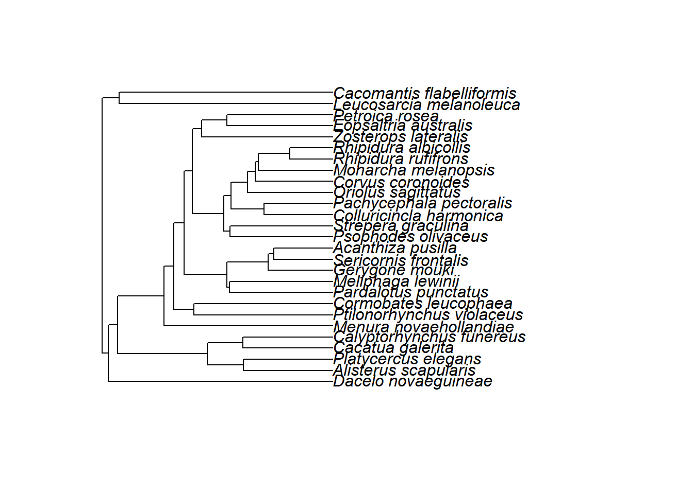
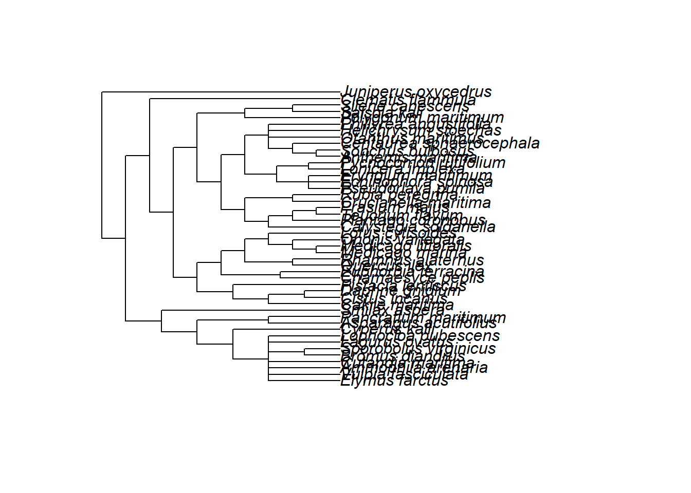

A Quick introudction for chaolab utility
================

<!-- README.md is generated from README.Rmd. Please edit that file -->
overview
========

``` r
library(chaoUtility)
```

`chaoUtility` focuses on some useful tools for chao lab, include:

general functions:[`Boot_p()`](#boot_p) and `checktype()`

phylogeny fucntions:

-[`phylo2phytree()`](#phylo2phytree) : input phylo object([ultrmetric](#examples-ultrametictree) or [non-ultrametric](#examples-non-ultrametictree)), return chaophytree object

-[`phyExpandData()`](#phyexpanddata) : input abundance data, label,chaophytree object, return tibble with abundance or [incidence data](#examples-incidence-simple-data).

-[`phyExpandData()`](#phyexpanddata) : input abundance data, label,chaophytree object, return tibble with abundance or [incidence data](#examples-incidence-simple-data).

-[`phylengthbyT()`](#phylengthbyt) : input vector of ageT, chaophytree object, return matrix with label and new branch.length (default `rootExtend =T` ,if `rootExtend=T and ageT>treeH`, root.length=ageT-treeH), [non ultrametric tree example](#examples-non-ultrametric-tree-by-reference-t)

-[`phyBranchAL()`](#phybranchal) : input abundance data,phylo object,vector of ageTs, return Chaophyabu object (default `rootExtend =T` ,`remove0=T`)

-[`phyBranchALinc()`](#phybranchalinc) : input incidence\_raw data,phylo object,vector of ageTs, return Chaophyabu object (default `rootExtend =T` ,`remove0=T`)

-`phylo2chaolabphy()`

HOW TO RUN chaoUtility:
-----------------------

The `chaoUtility` package can be downloaded with a standard R installation procedure using the following commands.

``` r
## install the latest version from github
install.packages('devtools')
library(devtools)
install_github('chaolab2019/chaoUtility')
```

Boot\_p
-------

We first describe the main function `Boot_p()` with default arguments:

``` r
Boot_p(x,zero=TRUE,Bootype="One",datatype="abundance")
```

<table style="width:100%;">
<colgroup>
<col width="20%">
<col width="80%">
</colgroup>
<thead>
<tr class="header">
<th align="center">
Argument
</th>
<th align="left">
Description
</th>
</tr>
</thead>
<tbody>
<tr class="odd">
<td align="center">
<code>x</code>
</td>
<td align="left">
a <code>matrix</code>, <code>data.frame</code>, <code>lists</code> of species abundances or incidence data.
</td>
</tr>
<tr class="even">
<td align="center">
<code>zero</code>
</td>
<td align="left">
reserves zero frequency or not. Default is TRUE.
</td>
</tr>
<tr class="odd">
<td align="center">
<code>Bootype</code>
</td>
<td align="left">
<code>character</code> : "One" or "JADE" or "SAR". `Bootype = "One"` or `Bootype = "JADE"` or `Bootype = "SAR"`<br> "One": from \#99 2013 Entropy and the species accumulation curve Appendix S2: Estimating species relative abundance. <br>"JADE": from \#107 Unveiling the species-rank abundance distribution by generalizing the Good-Turing sample coverage theory. <br>"SAR": :sampleing which was drawn without replacement (based on one parameter estimated method)
</td>
<tr class="even">
<td align="center">
<code>datatype</code>
</td>
<td align="left">
data type of input data: individual-based abundance data (`datatype = "abundance"`), or species by sampling-units incidence frequency (`datatype = "incidence_freq"` or `datatype = "incidence"`),or species by sampling-units incidence matrix (`datatype = "incidence_raw"`).
</td>
</tbody>
</table>
EXAMPLES
--------

without replacement:

``` r
library(chaoUtility)
data(bird)
bird.abun<- bird$abun
Boot_p(bird$abun,zero=FALSE,Bootype="SAR",datatype="abundance",rho=0.8)
$North.site
 [1] 43  2  2  5  4  4 12  1  2  4 13  2 10  9  1  2 14 11  3  7  2 17  7
[24]  3  2 17  2  1

$South.site
 [1]  3 17 30  3  2  2  6  7 34  6 12  1  4  6  6  7 14  5 10  8  2 15  1
[24] 19  1  3  9  8  2  4 15 15  2  4  5  2 15  2

data(incdata)
Boot_p(incdata,zero=FALSE,Bootype="SAR",datatype="incidence",rho=0.8)
$Monsoon
plots                                                                   
  191     7     8     3    31     2    70     2     2     4    11     2 
                                                                        
    3     1     4    52     8     2     3    46     2     7    12    64 
                                                                        
  135    21     2    19     4     1     8     2     2    98     1     2 
                                                                        
    2     1     6     1    25     2     2    36     7     4    13     5 
                                                                        
    2     3    47     6    82    33     5     2     3     4     5     7 
                                                                        
    5    20     5    17    29     2     2    34     5    23     1    37 
                                                                        
    4     3    74     8     2    33    38    21    13    30    71     2 
                                                                        
    2    48     7     1     2    11     1   117    11    66    28   143 
                                                                        
    1     2     2     2     3     6    13   109    71     3    82    17 
                                                                        
    6     7     3     2    15    53    38     5     6     7    96    18 
                                                                        
   11     3   106    54    54     2     1     6     2     4     1    15 
                                                                        
    1     9     2     1    31    60     4    49     3     5    38     2 
                                                                        
   17    94     2    76    24    42     1     1    73    91    16     5 
                                                                        
    2    41     5     7    16     3     8     3    10    52    96     7 
                                                                        
   23     1    25    10    98     2     2     6    20    40    37    12 
                                                                        
   18     5    29     5     1     4   112     3     8     3    16    33 
                                                                        
    2     3    22    52   185    60     6     2    39    66     2    40 
                                                                        
   43     3     1    23     2     4     4    29    65   114     2     2 
                                                                        
    3     2    13     3     2     3    37   107     4    10    24     8 
                                                                        
   10     2     3    43     2     7    51     5    14     6    47    10 
                                                                        
   14     6     1     5     2     2     2     1     2     2    15    18 
                                                                        
   22     9    11     2   139    98    69     3    75     2     2     2 
                                                                        
   34     1    12     2    12     2     2     4     2    11    31   162 
                                                                        
    5     1     1    18     2    34     2     2     1     2    48    33 
                                                                        
    2     1     8    44     5     2     2     2    46     3    35    18 
                                                                        
    7     2     4     4     1     0    45    21    61    14     3    11 
                                                                        
    8     2    66    19    61    15     4     2     3     7     2     8 
                                                                        
   44     2    25     2   108     2     2     1     2     1     2     1 
                                                            
    2     2     2     2     2     2     2     2     2     2 

$Upper.cloud
plots                                                                   
  153     1     2     0     6    22    14     6    13    35    16     1 
                                                                        
    3     2     1    35     2     1     6     8    29     3     3    34 
                                                                        
    2     8    55    49     2     1     9     2    40     3     4    56 
                                                                        
    7     2     9    36    53    81    59     2     8    44     2    71 
                                                                        
    1     2     2     4    45     3     5     2     1     3     2    31 
                                                                        
   57    45    86    19     8    32    11     5    10     0     2     2 
                                                                        
    2     6     1     3    61    34    10     5     3     4     2    18 
                                                                        
    4    62     1     0    41    18     2     3     1     2    11     1 
                                                                        
    4     4     2     2    30     1     9    43     1    14     0    25 
                                                                        
   11    24     2    13     2     2     2    24    37    68     3     3 
                                                                        
    5    16   141     1     2     3    11    11     2     3     2     1 
                                                                        
   18    11     7    18     2     2     2     2    30     1     3     4 
                                                                        
    8    17     2    12     2    13     2     8     3     4     4    15 
                                                                        
    4    47     2     8     4     0     4     5     5     4     4     2 
                                                                        
    2     5     4     2    45    88     2     2     2     8     8     1 
                                                                        
    1     3    23    14     2     2     4     6    35     3     5     2 
                                                                        
    3     2     2    40    48     7     4    15     4    45    60     2 
                                                                        
   95     7     4     4    35    24     2    13     8    70     3     2 
                                                                        
  105    86     1     7     4     4     8     2     9     6     1     3 
                                                                        
   27     3     8     6     3     2     1     2    25     6    23     2 
                                                                        
    2     2     2     2     1     2     1     2     2     2     2     2 
      
    2 
```

with replacement:One

``` r
library(chaoUtility)
data(bird)
bird.inc <- bird$inci
bird.abun<- bird$abun
Boot_p(bird$abun, datatype="abundance")
$North.site
           Acanthiza_lineata               Acanthiza_nana 
                 0.000000000                  0.000000000 
           Acanthiza_pusilla Acanthorhynchus_tenuirostris 
                 0.202970297                  0.000000000 
        Alisterus_scapularis             Cacatua_galerita 
                 0.013711189                  0.002085140 
   Cacomantis_flabelliformis     Calyptorhynchus_funereus 
                 0.024505461                  0.019252435 
     Colluricincla_harmonica        Cormobates_leucophaea 
                 0.019252435                  0.054454394 
           Corvus_coronoides          Dacelo_novaeguineae 
                 0.002085140                  0.007808497 
        Eopsaltria_australis               Gerygone_mouki 
                 0.024505461                  0.059405543 
     Leucosarcia_melanoleuca       Lichenostomus_chrysops 
                 0.002085140                  0.000000000 
             Malurus_cyaneus             Malurus_lamberti 
                 0.000000000                  0.000000000 
        Manorina_melanophrys            Meliphaga_lewinii 
                 0.000000000                  0.054454394 
      Menura_novaehollandiae          Monarcha_melanopsis 
                 0.044547402                  0.002085140 
         Neochmia_temporalis           Oriolus_sagittatus 
                 0.000000000                  0.002085140 
       Pachycephala_olivacea      Pachycephala_pectoralis 
                 0.000000000                  0.079207914 
    Pachycephala_rufiventris         Pardalotus_punctatus 
                 0.000000000                  0.074257406 
              Petroica_rosea           Phylidonyris_niger 
                 0.002085140                  0.000000000 
         Platycercus_elegans          Psophodes_olivaceus 
                 0.007808497                  0.034609444 
   Ptilonorhynchus_violaceus          Ptiloris_paradiseus 
                 0.007808497                  0.000000000 
        Rhipidura_albicollis          Rhipidura_rufifrons 
                 0.089108910                  0.039586152 
    Sericornis_citreogularis         Sericornis_frontalis 
                 0.000000000                  0.007808497 
          Strepera_graculina            Zoothera_lunulata 
                 0.013711189                  0.000000000 
         Zosterops_lateralis                              
                 0.079207914                  0.005901447 
                                                          
                 0.005901447                  0.005901447 
                                                          
                 0.005901447                  0.005901447 

$South.site
           Acanthiza_lineata               Acanthiza_nana 
                 0.009205941                  0.058631921 
           Acanthiza_pusilla Acanthorhynchus_tenuirostris 
                 0.100977199                  0.005480418 
        Alisterus_scapularis             Cacatua_galerita 
                 0.001844732                  0.005480418 
   Cacomantis_flabelliformis     Calyptorhynchus_funereus 
                 0.016162296                  0.001844732 
     Colluricincla_harmonica        Cormobates_leucophaea 
                 0.019490072                  0.104234528 
           Corvus_coronoides          Dacelo_novaeguineae 
                 0.000000000                  0.000000000 
        Eopsaltria_australis               Gerygone_mouki 
                 0.016162296                  0.032571812 
     Leucosarcia_melanoleuca       Lichenostomus_chrysops 
                 0.001844732                  0.012754851 
             Malurus_cyaneus             Malurus_lamberti 
                 0.019490072                  0.019490072 
        Manorina_melanophrys            Meliphaga_lewinii 
                 0.029312227                  0.058631921 
      Menura_novaehollandiae          Monarcha_melanopsis 
                 0.016162296                  0.032571812 
         Neochmia_temporalis           Oriolus_sagittatus 
                 0.029312227                  0.000000000 
       Pachycephala_olivacea      Pachycephala_pectoralis 
                 0.005480418                  0.048859923 
    Pachycephala_rufiventris         Pardalotus_punctatus 
                 0.009205941                  0.055374591 
              Petroica_rosea           Phylidonyris_niger 
                 0.001844732                  0.005480418 
         Platycercus_elegans          Psophodes_olivaceus 
                 0.022778664                  0.022778664 
   Ptilonorhynchus_violaceus          Ptiloris_paradiseus 
                 0.005480418                  0.009205941 
        Rhipidura_albicollis          Rhipidura_rufifrons 
                 0.065146580                  0.045602574 
    Sericornis_citreogularis         Sericornis_frontalis 
                 0.005480418                  0.019490072 
          Strepera_graculina            Zoothera_lunulata 
                 0.012754851                  0.001844732 
         Zosterops_lateralis                              
                 0.055374591                  0.005386634 
                                                          
                 0.005386634                  0.005386634 
```

References
----------

-   Chao, A., Wang, Y. T., and Jost, L. (2013). Entropy and the species accumulation curve: a novel estimator of entropy via discovery rates of new species. Methods in Ecology and Evolution, 4, 1091-1110.
-   Chao, A., Hsieh, T. C., Chazdon, R. L., Colwell, R. K., and Gotelli, N. J. (2015). Unveiling the species-rank abundance distribution by generalizing the Good-Turing sample coverage theory. Ecology 96, 1189-1201.

[back](#overview)

phylo2phytree
-------------

### examples ultrametictree

``` r
library(chaoUtility)
data(treesample)
newphy<-phylo2phytree(treesample)

class(newphy)
[1] "chaophytree"
```

``` r
newphy$tips
       Elymus_farctus    Vulpia_fasciculata    Ammophila_arenaria 
                97.50                 97.50                 97.50 
  Lophocloa_pubescens         Cyperus_kalli Asparagus_acutifolius 
                97.50                146.25                 97.50 
 Pancratium_maritimum      Lonicera_implexa 
                97.50                292.50 

newphy$nodes
poales_to_asterales                  I1                  I2 
               0.00               97.50               48.75 
            poaceae                  I4 
              48.75               97.50 

newphy$phytree
# A tibble: 13 x 6
   parent  node branch.length label                 tgroup node.age
    <int> <int>         <dbl> <chr>                 <chr>     <dbl>
 1     12     1          97.5 Elymus_farctus        Tip         0  
 2     12     2          97.5 Vulpia_fasciculata    Tip         0  
 3     12     3          97.5 Ammophila_arenaria    Tip         0  
 4     12     4          97.5 Lophocloa_pubescens   Tip         0  
 5     11     5         146.  Cyperus_kalli         Tip         0  
 6     13     6          97.5 Asparagus_acutifolius Tip         0  
 7     13     7          97.5 Pancratium_maritimum  Tip         0  
 8      9     8         292.  Lonicera_implexa      Tip         0  
 9      9     9           0   poales_to_asterales   Root      292. 
10      9    10          97.5 I1                    Inode     195  
11     10    11          48.8 I2                    Inode     146. 
12     11    12          48.8 poaceae               Inode      97.5
13     10    13          97.5 I4                    Inode      97.5


newphy$treeH
[1] 292.5
```

``` r
library(ape)
plot(treesample)
tiplabels()
nodelabels()
library(dplyr)
nodetext<-newphy$phytree %>% filter(tgroup!="Tip") %>% pull(label)
nodelabels(text=nodetext,adj=c(0,2.2))
edgelabels(treesample$edge.length, bg="black", col="white", font=2)
```

 [back](#overview)

### examples non ultrametictree

``` r
text<-"(((((((A:4,B:4):6,C:5):8,D:6):3,E:21):10,((F:4,G:12):14,H:8):13):13,((I:5,J:2):30,(K:11,L:11):2):17):4,M:56);"
library(ape)
tree2<-read.tree(text=text)

library(chaoUtility)
tree2.phytree<-phylo2phytree(tree2)

library(dplyr)
nodetext<-tree2.phytree$phytree %>% filter(tgroup!="Tip") %>% pull(label)
plot(tree2)
nodelabels(text=nodetext)
edgelabels(tree2$edge.length, bg="black", col="white", font=2)
```


``` r

tree2.phytree$treeH
[1] 56

as.data.frame(tree2.phytree$phytree)
   parent node branch.length label tgroup node.age
1      20    1             4     A    Tip        8
2      20    2             4     B    Tip        8
3      19    3             5     C    Tip       13
4      18    4             6     D    Tip       20
5      17    5            21     E    Tip        8
6      22    6             4     F    Tip        8
7      22    7            12     G    Tip        0
8      21    8             8     H    Tip       18
9      24    9             5     I    Tip        0
10     24   10             2     J    Tip        3
11     25   11            11     K    Tip       22
12     25   12            11     L    Tip       22
13     14   13            56     M    Tip        0
14     14   14             0  Root   Root       56
15     14   15             4    I1  Inode       52
16     15   16            13    I2  Inode       39
17     16   17            10    I3  Inode       29
18     17   18             3    I4  Inode       26
19     18   19             8    I5  Inode       18
20     19   20             6    I6  Inode       12
21     16   21            13    I7  Inode       26
22     21   22            14    I8  Inode       12
23     15   23            17    I9  Inode       35
24     23   24            30   I10  Inode        5
25     23   25             2   I11  Inode       33

tree2.phytree$leaves
NULL

tree2.phytree$nodes
Root   I1   I2   I3   I4   I5   I6   I7   I8   I9  I10  I11 
   0    4   13   10    3    8    6   13   14   17   30    2 
```

[back](#overview)

### examples non ultrametictree

``` r
text<-"(((((((A:4,B:4):6,C:5):8,D:6):3,E:21):10,((F:4,G:12):14,H:8):13):13,((I:5,J:2):30,(K:11,L:11):2):17):4,M:56);"
library(ape)
tree2<-read.tree(text=text)

library(chaoUtility)
tree2.phytree<-phylo2phytree(tree2)

library(dplyr)
nodetext<-tree2.phytree$phytree %>% filter(tgroup!="Tip") %>% pull(label)
plot(tree2)
nodelabels(text=nodetext)
edgelabels(tree2$edge.length, bg="black", col="white", font=2)
```


``` r

tree2.phytree$treeH
[1] 56

as.data.frame(tree2.phytree$phytree)
   parent node branch.length label tgroup node.age
1      20    1             4     A    Tip        8
2      20    2             4     B    Tip        8
3      19    3             5     C    Tip       13
4      18    4             6     D    Tip       20
5      17    5            21     E    Tip        8
6      22    6             4     F    Tip        8
7      22    7            12     G    Tip        0
8      21    8             8     H    Tip       18
9      24    9             5     I    Tip        0
10     24   10             2     J    Tip        3
11     25   11            11     K    Tip       22
12     25   12            11     L    Tip       22
13     14   13            56     M    Tip        0
14     14   14             0  Root   Root       56
15     14   15             4    I1  Inode       52
16     15   16            13    I2  Inode       39
17     16   17            10    I3  Inode       29
18     17   18             3    I4  Inode       26
19     18   19             8    I5  Inode       18
20     19   20             6    I6  Inode       12
21     16   21            13    I7  Inode       26
22     21   22            14    I8  Inode       12
23     15   23            17    I9  Inode       35
24     23   24            30   I10  Inode        5
25     23   25             2   I11  Inode       33

tree2.phytree$leaves
NULL

tree2.phytree$nodes
Root   I1   I2   I3   I4   I5   I6   I7   I8   I9  I10  I11 
   0    4   13   10    3    8    6   13   14   17   30    2 
```

phyExpandData
-------------

### EXAMPLES:abundance data

``` r
library(chaoUtility)
data(phybird.new)
bird.abu <- phybird.new$abun
bird.lab <- rownames(phybird.new$abun)
bird.phy <- phybird.new$chaophytree

bird.abu
                             North.site South.site
Acanthiza_lineata                     0          3
Acanthiza_nana                        0         18
Acanthiza_pusilla                    41         31
Acanthorhynchus_tenuirostris          0          2
Alisterus_scapularis                  3          1
Cacatua_galerita                      1          2
Cacomantis_flabelliformis             5          5
Calyptorhynchus_funereus              4          1
Colluricincla_harmonica               4          6
Cormobates_leucophaea                11         32
Corvus_coronoides                     1          0
Dacelo_novaeguineae                   2          0
Eopsaltria_australis                  5          5
Gerygone_mouki                       12         10
Leucosarcia_melanoleuca               1          1
Lichenostomus_chrysops                0          4
Malurus_cyaneus                       0          6
Malurus_lamberti                      0          6
Manorina_melanophrys                  0          9
Meliphaga_lewinii                    11         18
Menura_novaehollandiae                9          5
Monarcha_melanopsis                   1         10
Neochmia_temporalis                   0          9
Oriolus_sagittatus                    1          0
Pachycephala_olivacea                 0          2
Pachycephala_pectoralis              16         15
Pachycephala_rufiventris              0          3
Pardalotus_punctatus                 15         17
Petroica_rosea                        1          1
Phylidonyris_niger                    0          2
Platycercus_elegans                   2          7
Psophodes_olivaceus                   7          7
Ptilonorhynchus_violaceus             2          2
Ptiloris_paradiseus                   0          3
Rhipidura_albicollis                 18         20
Rhipidura_rufifrons                   8         14
Sericornis_citreogularis              0          2
Sericornis_frontalis                  2          6
Strepera_graculina                    3          4
Zoothera_lunulata                     0          1
Zosterops_lateralis                  16         17

bird.lab
 [1] "Acanthiza_lineata"            "Acanthiza_nana"              
 [3] "Acanthiza_pusilla"            "Acanthorhynchus_tenuirostris"
 [5] "Alisterus_scapularis"         "Cacatua_galerita"            
 [7] "Cacomantis_flabelliformis"    "Calyptorhynchus_funereus"    
 [9] "Colluricincla_harmonica"      "Cormobates_leucophaea"       
[11] "Corvus_coronoides"            "Dacelo_novaeguineae"         
[13] "Eopsaltria_australis"         "Gerygone_mouki"              
[15] "Leucosarcia_melanoleuca"      "Lichenostomus_chrysops"      
[17] "Malurus_cyaneus"              "Malurus_lamberti"            
[19] "Manorina_melanophrys"         "Meliphaga_lewinii"           
[21] "Menura_novaehollandiae"       "Monarcha_melanopsis"         
[23] "Neochmia_temporalis"          "Oriolus_sagittatus"          
[25] "Pachycephala_olivacea"        "Pachycephala_pectoralis"     
[27] "Pachycephala_rufiventris"     "Pardalotus_punctatus"        
[29] "Petroica_rosea"               "Phylidonyris_niger"          
[31] "Platycercus_elegans"          "Psophodes_olivaceus"         
[33] "Ptilonorhynchus_violaceus"    "Ptiloris_paradiseus"         
[35] "Rhipidura_albicollis"         "Rhipidura_rufifrons"         
[37] "Sericornis_citreogularis"     "Sericornis_frontalis"        
[39] "Strepera_graculina"           "Zoothera_lunulata"           
[41] "Zosterops_lateralis"         


phyExpandData(x=bird.abu, labels=bird.lab, phy=bird.phy, datatype="abundance")
$North.site
# A tibble: 81 x 7
   parent  node branch.length label             tgroup node.age branch.abun
    <int> <int>         <dbl> <chr>             <chr>     <dbl>       <int>
 1     46     1          32.0 Alisterus_scapul~ Tip           0           3
 2     46     2          32.0 Platycercus_eleg~ Tip           0           2
 3     47     3          32.1 Cacatua_galerita  Tip           0           1
 4     47     4          32.1 Calyptorhynchus_~ Tip           0           4
 5     48     5          60.6 Menura_novaeholl~ Tip           0           9
 6     50     6          49.8 Ptilonorhynchus_~ Tip           0           2
 7     50     7          49.8 Cormobates_leuco~ Tip           0          11
 8     53     8          14.3 Malurus_lamberti  Tip           0           0
 9     53     9          14.3 Malurus_cyaneus   Tip           0           0
10     55    10          37.0 Pardalotus_punct~ Tip           0          15
# ... with 71 more rows

$South.site
# A tibble: 81 x 7
   parent  node branch.length label             tgroup node.age branch.abun
    <int> <int>         <dbl> <chr>             <chr>     <dbl>       <int>
 1     46     1          32.0 Alisterus_scapul~ Tip           0           1
 2     46     2          32.0 Platycercus_eleg~ Tip           0           7
 3     47     3          32.1 Cacatua_galerita  Tip           0           2
 4     47     4          32.1 Calyptorhynchus_~ Tip           0           1
 5     48     5          60.6 Menura_novaeholl~ Tip           0           5
 6     50     6          49.8 Ptilonorhynchus_~ Tip           0           2
 7     50     7          49.8 Cormobates_leuco~ Tip           0          32
 8     53     8          14.3 Malurus_lamberti  Tip           0           6
 9     53     9          14.3 Malurus_cyaneus   Tip           0           6
10     55    10          37.0 Pardalotus_punct~ Tip           0          17
# ... with 71 more rows
```

### examples incidence simple data

``` r
library(chaoUtility)
data(phyincisimple)
data.inc <- phyincisimple$inci.simple.data
data.lab<-rownames(data.inc)
phy.inc<-phyincisimple$tree.simple.phytree
```

[back](#overview)

### examples incidence simple data

``` r
library(chaoUtility)
data(phyincisimple.new)
data.inc <- phyincisimple.new$inci.simple.data
data.lab<-rownames(data.inc)
phy.inc<-phyincisimple.new$tree.simple.phytree


phylotree<-phyincisimple.new$tree.simple
plot(phylotree)
nodetext<-phy.inc$phytree %>% filter(tgroup!="Tip") %>% pull(label)
nodelabels(text=nodetext)
edgelabels(phylotree$edge.length, bg="black", col="white", font=2)
```


``` r
data.inc
  p1 p2 p3 p4 p5 p6
A  1  1  1  1  0  0
B  1  0  1  0  1  1
C  0  0  1  0  0  1
D  0  1  0  1  1  0
E  1  1  0  1  1  0

dataNtree<-phyExpandData(data.inc, labels=data.lab, phy=phy.inc, datatype="incidence_raw")
as.data.frame(dataNtree)
  parent node branch.length label tgroup node.age branch.abun
1      8    1           0.2     A    Tip      0.0           4
2      8    2           0.2     B    Tip      0.0           4
3      9    3           0.3     C    Tip      0.0           2
4      9    4           0.3     D    Tip      0.0           3
5      6    5           0.8     E    Tip      0.0           4
6      6    6           1.0  Root   Root      0.8           6
7      6    7           0.3    I1  Inode      0.5           6
8      7    8           0.3    I2  Inode      0.2           6
9      7    9           0.2    I3  Inode      0.3           5
```

[back](#overview)

phyLengthbyT
------------

### EXAMPLES

``` r
library(chaoUtility)
data(phybird)
bird.phy <- phybird$chaophytree


bird.phy$treeH
[1] 82.8575

phyLengthbyT(Ts=c(90,75,55), phy=bird.phy, datatype="abundance")
                                   [,1]       [,2]       [,3]
Alisterus_scapularis         31.9659554 31.9659554 31.9659554
Platycercus_elegans          31.9659554 31.9659554 31.9659554
Cacatua_galerita             32.1466904 32.1466904 32.1466904
Calyptorhynchus_funereus     32.1466904 32.1466904 32.1466904
Menura_novaehollandiae       60.6248485 60.6248485 55.0000000
Ptilonorhynchus_violaceus    49.8413606 49.8413606 49.8413606
Cormobates_leucophaea        49.8413606 49.8413606 49.8413606
Malurus_lamberti             14.3265737 14.3265737 14.3265737
Malurus_cyaneus              14.3265737 14.3265737 14.3265737
Pardalotus_punctatus         36.9602832 36.9602832 36.9602832
Phylidonyris_niger           29.7638223 29.7638223 29.7638223
Meliphaga_lewinii            19.8034030 19.8034030 19.8034030
Manorina_melanophrys         15.9536491 15.9536491 15.9536491
Lichenostomus_chrysops       15.9536490 15.9536490 15.9536490
Acanthorhynchus_tenuirostris 27.5349436 27.5349436 27.5349436
Sericornis_frontalis         14.5326945 14.5326945 14.5326945
Sericornis_citreogularis     14.5326945 14.5326945 14.5326945
Acanthiza_pusilla            13.6642770 13.6642770 13.6642770
Acanthiza_nana               10.9532494 10.9532494 10.9532494
Acanthiza_lineata            10.9532494 10.9532494 10.9532494
Gerygone_mouki               23.0715047 23.0715047 23.0715047
Psophodes_olivaceus          36.8231156 36.8231156 36.8231156
Strepera_graculina           36.8231156 36.8231156 36.8231156
Colluricincla_harmonica      24.5403935 24.5403935 24.5403935
Pachycephala_pectoralis      11.1569810 11.1569810 11.1569810
Pachycephala_rufiventris     11.1569810 11.1569810 11.1569810
Pachycephala_olivacea        16.5433092 16.5433092 16.5433092
Oriolus_sagittatus           30.5513069 30.5513069 30.5513069
Monarcha_melanopsis          25.4610513 25.4610513 25.4610513
Ptiloris_paradiseus          25.4610513 25.4610513 25.4610513
Rhipidura_rufifrons          15.4390507 15.4390507 15.4390507
Rhipidura_albicollis         15.4390507 15.4390507 15.4390507
Corvus_coronoides            27.8225694 27.8225694 27.8225694
Eopsaltria_australis         37.9655378 37.9655378 37.9655378
Petroica_rosea               37.9655377 37.9655377 37.9655377
Zosterops_lateralis          44.5429809 44.5429809 44.5429809
Zoothera_lunulata            43.6284208 43.6284208 43.6284208
Neochmia_temporalis          43.6284206 43.6284206 43.6284206
Dacelo_novaeguineae          80.5684691 75.0000000 55.0000000
Leucosarcia_melanoleuca      76.7365165 75.0000000 55.0000000
Cacomantis_flabelliformis    76.7365166 75.0000000 55.0000000
Root                          7.1424967  0.0000000  0.0000000
I1                            2.2890338  0.0000000  0.0000000
I2                            3.3780170  0.0000000  0.0000000
I3                           32.1763058 29.9858534  9.9858534
I4                           13.0481910 13.0481910 13.0481910
I5                           12.8674561 12.8674561 12.8674561
I6                           16.5656036 14.3751512  0.0000000
I7                            3.6411840  3.6411840  0.0000000
I8                            7.1423040  7.1423040  5.1586393
I9                            3.5604001  3.5604001  1.5767354
I10                           7.7250663  7.7250663  7.7250663
I11                          31.3716245 31.3716245 31.3716245
I12                           7.6639121  7.6639121  7.6639121
I13                           1.0740030  1.0740030  1.0740030
I14                           7.1964609  7.1964609  7.1964609
I15                           2.2288786  2.2288786  2.2288786
I16                           7.7315406  7.7315406  7.7315406
I17                           3.8497540  3.8497540  3.8497540
I18                          14.9627814 14.9627814 14.9627814
I19                           1.8811889  1.8811889  1.8811889
I20                           6.6576213  6.6576213  6.6576213
I21                           7.5260388  7.5260388  7.5260388
I22                           2.7110275  2.7110275  2.7110275
I23                           3.0724789  3.0724789  3.0724789
I24                          11.2166519 11.2166519 11.2166519
I25                           2.3110182  2.3110182  2.3110182
I26                           2.7312937  2.7312937  2.7312937
I27                          11.8624466 11.8624466 11.8624466
I28                           7.9970842  7.9970842  7.9970842
I29                           5.3863282  5.3863282  5.3863282
I30                           5.8515332  5.8515332  5.8515332
I31                           2.7287374  2.7287374  2.7287374
I32                           1.2437461  1.2437461  1.2437461
I33                           1.1177720  1.1177720  1.1177720
I34                          11.1397726 11.1397726 11.1397726
I35                           3.3279815  3.3279815  3.3279815
I36                           9.0572663  9.0572663  9.0572663
I37                           2.4798231  2.4798231  2.4798231
I38                           0.9145603  0.9145603  0.9145603
I39                           6.1209866  0.0000000  0.0000000
```

[back](#overview)

### examples non ultrametric tree by reference t

``` r
text<-"(((((((A:4,B:4):6,C:5):8,D:6):3,E:21):10,((F:4,G:12):14,H:8):13):13,((I:5,J:2):30,(K:11,L:11):2):17):4,M:56);"
library(ape)
tree2<-read.tree(text=text)
```

### examples non ultrametric tree by reference t

``` r
text<-"(((((((A:4,B:4):6,C:5):8,D:6):3,E:21):10,((F:4,G:12):14,H:8):13):13,((I:5,J:2):30,(K:11,L:11):2):17):4,M:56);"
library(ape)
tree2<-read.tree(text=text)

library(chaoUtility)
phytree<-phylo2phytree(tree2)

phytree$treeH
[1] 56

phyLengthbyT(Ts=c(75,55,50), phy=phytree, datatype="abundance",rootExtend=T)
     [,1] [,2] [,3]
A       4    4    4
B       4    4    4
C       5    5    5
D       6    6    6
E      21   21   21
F       4    4    4
G      12   12   12
H       8    8    8
I       5    5    5
J       2    2    2
K      11   11   11
L      11   11   11
M      56   55   50
Root   19    0    0
I1      4    3    0
I2     13   13   11
I3     10   10   10
I4      3    3    3
I5      8    8    8
I6      6    6    6
I7     13   13   13
I8     14   14   14
I9     17   17   15
I10    30   30   30
I11     2    2    2

library(dplyr)
nodetext<-phytree$phytree %>% filter(tgroup!="Tip") %>% pull(label)
plot(tree2)
nodelabels(text=nodetext)
edgelabels(tree2$edge.length, bg="black", col="white", font=2)
```


``` r

as.data.frame(phytree$phytree)
   parent node branch.length label tgroup node.age
1      20    1             4     A    Tip        8
2      20    2             4     B    Tip        8
3      19    3             5     C    Tip       13
4      18    4             6     D    Tip       20
5      17    5            21     E    Tip        8
6      22    6             4     F    Tip        8
7      22    7            12     G    Tip        0
8      21    8             8     H    Tip       18
9      24    9             5     I    Tip        0
10     24   10             2     J    Tip        3
11     25   11            11     K    Tip       22
12     25   12            11     L    Tip       22
13     14   13            56     M    Tip        0
14     14   14             0  Root   Root       56
15     14   15             4    I1  Inode       52
16     15   16            13    I2  Inode       39
17     16   17            10    I3  Inode       29
18     17   18             3    I4  Inode       26
19     18   19             8    I5  Inode       18
20     19   20             6    I6  Inode       12
21     16   21            13    I7  Inode       26
22     21   22            14    I8  Inode       12
23     15   23            17    I9  Inode       35
24     23   24            30   I10  Inode        5
25     23   25             2   I11  Inode       33
```

[back](#overview)

\#phybranchal
-------------

### EXAMPLES-improve performance

``` r
 data(AbuALdata)
 adata<-AbuALdata$abudata
 atree<-AbuALdata$tree
 vdata<-adata$EM
 names(vdata)<-rownames(adata)
 vdata
     Juniperus_oxycedrus        Clematis_flammula         Silene_canescens 
                       0                        0                        0 
            Salsola_kali      Polygonum_maritimum   Phillyrea_angustifolia 
                      72                       14                        0 
    Helichrysum_stoechas       Otanthus_maritimus Centaurea_sphaerocephala 
                       0                       16                        0 
        Sonchus_bulbosus        Anthemis_maritima    Pycnocomon_rutifolium 
                       0                        9                        0 
        Lonicera_implexa       Eryngium_maritimum      Echinophora_spinosa 
                       0                        8                       11 
      Pseudorlaya_pumila          Rubia_peregrina     Crucianella_maritima 
                       0                        0                        0 
           Prasium_majus          Teucrium_flavum       Plantago_coronopus 
                       0                        0                        1 
   Calystegia_soldanella         Lotus_cytisoides         Ononis_variegata 
                      10                        0                        2 
     Medicago_littoralis          Medicago_marina        Rhamnus_alaternus 
                       0                        1                        0 
            Quercus_ilex      Euphorbia_terracina        Chamaesyce_peplis 
                       0                        0                       36 
      Pistacia_lentiscus           Daphne_gnidium           Cistus_incanus 
                       0                        0                        0 
         Cakile_maritima            Smilax_aspera     Pancratium_maritimum 
                      81                        0                        6 
   Asparagus_acutifolius            Cyperus_kalli      Lophocloa_pubescens 
                       0                        1                        0 
          Lagurus_ovatus    Sporobolus_virginicus          Bromus_diandrus 
                       0                       42                        0 
       Cutandia_maritima       Ammophila_arenaria       Vulpia_fasciculata 
                       3                        0                        0 
          Elymus_farctus 
                      60 
 
 refTs<-c(400,250,100)
 result<-phyBranchAL_Abu(atree,vdata,datatype="abundance",refTs)
 
 ##final branch.abu:removed abu=0
 treeNabu<-result$treeNabu
 treeNabu %>% print(n = Inf)
# A tibble: 32 x 6
   parent  node branch.length tgroup label                 branch.abun
    <int> <int>         <dbl> <chr>  <chr>                       <int>
 1     21     1          97.5 Tip    Elymus_farctus                 60
 2     21     2          97.5 Tip    Cutandia_maritima               3
 3     21     3          97.5 Tip    Sporobolus_virginicus          42
 4     20     4         146.  Tip    Cyperus_kalli                   1
 5     19     5         195   Tip    Pancratium_maritimum            6
 6     23     6         195   Tip    Cakile_maritima                81
 7     24     7         162.  Tip    Chamaesyce_peplis              36
 8     25     8          65   Tip    Medicago_marina                 1
 9     25     9          65   Tip    Ononis_variegata                2
10     28    10          97.5 Tip    Calystegia_soldanella          10
11     28    11          97.5 Tip    Plantago_coronopus              1
12     30    12          43.3 Tip    Echinophora_spinosa            11
13     30    13          43.3 Tip    Eryngium_maritimum              8
14     31    14          97.5 Tip    Anthemis_maritima               9
15     31    15          97.5 Tip    Otanthus_maritimus             16
16     32    16         130   Tip    Polygonum_maritimum            14
17     32    17         130   Tip    Salsola_kali                   72
18     18    18           0   Root   poales_to_asterales           373
19     18    19          97.5 Inode  I1                            112
20     19    20          48.8 Inode  I2                            106
21     20    21          48.8 Inode  poaceae                       105
22     18    22          65   Inode  I4                            261
23     22    23          32.5 Inode  I5                            120
24     23    24          32.5 Inode  I6                             39
25     24    25          97.5 Inode  I7                              3
26     22    26          32.5 Inode  I8                            141
27     26    27          32.5 Inode  I9                             55
28     27    28          65   Inode  I10                            11
29     27    29          32.5 Inode  I11                            44
30     29    30          86.7 Inode  apiaceae                       19
31     29    31          32.5 Inode  asteraceae                     25
32     26    32          65   Inode  caryophyllales                 86
 
 ##final treeH:removed abu=0
 result$treeH
[1] 292.5
 
 ##final branch.length:removed abu=0
 result$BLbyT
                           T400      T250      T100
Elymus_farctus         97.50000  97.50000  97.50000
Cutandia_maritima      97.50000  97.50000  97.50000
Sporobolus_virginicus  97.50000  97.50000  97.50000
Cyperus_kalli         146.25000 146.25000 100.00000
Pancratium_maritimum  195.00000 195.00000 100.00000
Cakile_maritima       195.00000 195.00000 100.00000
Chamaesyce_peplis     162.50000 162.50000 100.00000
Medicago_marina        65.00000  65.00000  65.00000
Ononis_variegata       65.00000  65.00000  65.00000
Calystegia_soldanella  97.50000  97.50000  97.50000
Plantago_coronopus     97.50000  97.50000  97.50000
Echinophora_spinosa    43.33333  43.33333  43.33333
Eryngium_maritimum     43.33333  43.33333  43.33333
Anthemis_maritima      97.50000  97.50000  97.50000
Otanthus_maritimus     97.50000  97.50000  97.50000
Polygonum_maritimum   130.00000 130.00000 100.00000
Salsola_kali          130.00000 130.00000 100.00000
poales_to_asterales   107.50000   0.00000   0.00000
I1                     97.50000  55.00000   0.00000
I2                     48.75000  48.75000   0.00000
poaceae                48.75000  48.75000   2.50000
I4                     65.00000  22.50000   0.00000
I5                     32.50000  32.50000   0.00000
I6                     32.50000  32.50000   0.00000
I7                     97.50000  97.50000  35.00000
I8                     32.50000  32.50000   0.00000
I9                     32.50000  32.50000   0.00000
I10                    65.00000  65.00000   2.50000
I11                    32.50000  32.50000   0.00000
apiaceae               86.66667  86.66667  56.66667
asteraceae             32.50000  32.50000   2.50000
caryophyllales         65.00000  65.00000   0.00000
 
 ####result$treeNabu is an object of tbl_tree could change to phylo
 tlb2phylo<-as.phylo(treeNabu)
 plot(tlb2phylo)
```


``` r
 
 
 ###this is the original tree
 plot(atree)
```


\#phybranchalinc
----------------

### EXAMPLES-improve performance

``` r
  data(phybird.new)
  bird.abu <- phybird.new$abun   
  bird.inc <- phybird.new$inci   
  bird.lab <- rownames(phybird.new$abun)   
  bird.phy <- phybird.new$chaophytree   
  tree<-as.phylo(bird.phy$phytree)   
  Idata<-bird.inc$North.site   
  
  Idata
                             F1O F2A F3A F3O F4A F4O F5A F5B F6A F6B F7A
Acanthiza_lineata              0   0   0   0   0   0   0   0   0   0   0
Acanthiza_nana                 0   0   0   0   0   0   0   0   0   0   0
Acanthiza_pusilla              1   1   1   1   1   1   1   1   1   1   1
Acanthorhynchus_tenuirostris   0   0   0   0   0   0   0   0   0   0   0
Alisterus_scapularis           0   0   1   0   0   0   0   0   1   0   0
Cacatua_galerita               0   0   0   0   0   0   1   0   0   0   0
Cacomantis_flabelliformis      0   1   0   0   1   0   1   1   1   0   0
Calyptorhynchus_funereus       0   0   0   0   0   0   0   0   0   1   0
Colluricincla_harmonica        1   1   0   0   0   0   0   0   0   0   0
Cormobates_leucophaea          1   1   1   1   1   1   1   1   0   1   0
Corvus_coronoides              0   0   0   0   0   0   0   1   0   0   0
Dacelo_novaeguineae            0   0   0   0   0   0   0   0   0   0   1
Eopsaltria_australis           1   0   0   1   0   1   1   0   1   0   0
Gerygone_mouki                 1   1   1   1   0   1   0   0   0   0   0
Leucosarcia_melanoleuca        0   1   0   0   0   0   0   0   0   0   0
Lichenostomus_chrysops         0   0   0   0   0   0   0   0   0   0   0
Malurus_cyaneus                0   0   0   0   0   0   0   0   0   0   0
Malurus_lamberti               0   0   0   0   0   0   0   0   0   0   0
Manorina_melanophrys           0   0   0   0   0   0   0   0   0   0   0
Meliphaga_lewinii              1   1   1   1   1   1   0   0   0   0   0
Menura_novaehollandiae         1   1   1   0   0   0   0   0   1   0   0
Monarcha_melanopsis            0   0   0   0   1   0   0   0   0   0   0
Neochmia_temporalis            0   0   0   0   0   0   0   0   0   0   0
Oriolus_sagittatus             0   0   1   0   0   0   0   0   0   0   0
Pachycephala_olivacea          0   0   0   0   0   0   0   0   0   0   0
Pachycephala_pectoralis        1   1   1   1   0   1   0   0   0   0   1
Pachycephala_rufiventris       0   0   0   0   0   0   0   0   0   0   0
Pardalotus_punctatus           1   0   1   1   1   0   1   1   0   0   1
Petroica_rosea                 0   0   0   0   0   0   0   0   0   0   1
Phylidonyris_niger             0   0   0   0   0   0   0   0   0   0   0
Platycercus_elegans            0   0   1   0   0   0   0   0   0   0   0
Psophodes_olivaceus            0   0   1   1   0   0   0   1   0   0   0
Ptilonorhynchus_violaceus      0   0   0   0   1   0   0   0   0   0   0
Ptiloris_paradiseus            0   0   0   0   0   0   0   0   0   0   0
Rhipidura_albicollis           1   1   0   1   0   1   1   1   1   1   1
Rhipidura_rufifrons            0   0   1   0   1   0   0   0   0   1   0
Sericornis_citreogularis       0   0   0   0   0   0   0   0   0   0   0
Sericornis_frontalis           1   0   0   1   0   0   0   0   0   0   0
Strepera_graculina             0   0   1   0   0   0   0   0   0   1   0
Zoothera_lunulata              0   0   0   0   0   0   0   0   0   0   0
Zosterops_lateralis            1   1   0   0   1   1   1   0   0   0   0
                             F7Q
Acanthiza_lineata              0
Acanthiza_nana                 0
Acanthiza_pusilla              1
Acanthorhynchus_tenuirostris   0
Alisterus_scapularis           0
Cacatua_galerita               0
Cacomantis_flabelliformis      0
Calyptorhynchus_funereus       0
Colluricincla_harmonica        0
Cormobates_leucophaea          0
Corvus_coronoides              0
Dacelo_novaeguineae            0
Eopsaltria_australis           0
Gerygone_mouki                 0
Leucosarcia_melanoleuca        0
Lichenostomus_chrysops         0
Malurus_cyaneus                0
Malurus_lamberti               0
Manorina_melanophrys           0
Meliphaga_lewinii              0
Menura_novaehollandiae         1
Monarcha_melanopsis            0
Neochmia_temporalis            0
Oriolus_sagittatus             0
Pachycephala_olivacea          0
Pachycephala_pectoralis        1
Pachycephala_rufiventris       0
Pardalotus_punctatus           0
Petroica_rosea                 0
Phylidonyris_niger             0
Platycercus_elegans            0
Psophodes_olivaceus            0
Ptilonorhynchus_violaceus      1
Ptiloris_paradiseus            0
Rhipidura_albicollis           1
Rhipidura_rufifrons            0
Sericornis_citreogularis       0
Sericornis_frontalis           0
Strepera_graculina             1
Zoothera_lunulata              0
Zosterops_lateralis            0

  refTs<-c(80,90,100)   
  result<-phyBranchAL_Inc(tree,Idata,datatype="incidence_raw",refTs)   

 ##final branch.abu:removed abu=0
 treeNabu<-result$treeNabu
 treeNabu %>% print(n = Inf)
# A tibble: 53 x 6
   parent  node branch.length tgroup label                     branch.abun
    <int> <int>         <dbl> <chr>  <chr>                           <dbl>
 1     32     1         32.0  Tip    Alisterus_scapularis                2
 2     32     2         32.0  Tip    Platycercus_elegans                 1
 3     33     3         32.1  Tip    Cacatua_galerita                    1
 4     33     4         32.1  Tip    Calyptorhynchus_funereus            1
 5     34     5         60.6  Tip    Menura_novaehollandiae              5
 6     36     6         49.8  Tip    Ptilonorhynchus_violaceus           2
 7     36     7         49.8  Tip    Cormobates_leucophaea               9
 8     39     8         37.0  Tip    Pardalotus_punctatus                7
 9     39     9         37.0  Tip    Meliphaga_lewinii                   6
10     41    10         21.2  Tip    Sericornis_frontalis                2
11     41    11         21.2  Tip    Acanthiza_pusilla                  12
12     40    12         23.1  Tip    Gerygone_mouki                      5
13     44    13         36.8  Tip    Psophodes_olivaceus                 3
14     44    14         36.8  Tip    Strepera_graculina                  3
15     46    15         24.5  Tip    Colluricincla_harmonica             2
16     46    16         24.5  Tip    Pachycephala_pectoralis             7
17     47    17         30.6  Tip    Oriolus_sagittatus                  1
18     49    18         26.6  Tip    Monarcha_melanopsis                 1
19     50    19         15.4  Tip    Rhipidura_rufifrons                 3
20     50    20         15.4  Tip    Rhipidura_albicollis               10
21     48    21         27.8  Tip    Corvus_coronoides                   1
22     52    22         38.0  Tip    Eopsaltria_australis                5
23     52    23         38.0  Tip    Petroica_rosea                      1
24     51    24         47.0  Tip    Zosterops_lateralis                 5
25     29    25         80.6  Tip    Dacelo_novaeguineae                 1
26     53    26         76.7  Tip    Leucosarcia_melanoleuca             1
27     53    27         76.7  Tip    Cacomantis_flabelliformis           5
28     28    28          0    Root   Root                               12
29     28    29          2.29 Inode  I1                                 12
30     29    30          3.38 Inode  I2                                 12
31     30    31         32.2  Inode  I3                                  4
32     31    32         13.0  Inode  I4                                  2
33     31    33         12.9  Inode  I5                                  2
34     30    34         16.6  Inode  I6                                 12
35     34    35          3.64 Inode  I7                                 12
36     35    36          7.14 Inode  I8                                 10
37     35    37          3.56 Inode  I9                                 12
38     37    38         15.4  Inode  I12                                12
39     38    39          1.07 Inode  I13                                 9
40     38    40         15.0  Inode  I18                                12
41     40    41          1.88 Inode  I19                                12
42     37    42          3.07 Inode  I23                                12
43     42    43         11.2  Inode  I24                                12
44     43    44          2.31 Inode  I25                                 5
45     43    45          2.73 Inode  I26                                12
46     45    46         11.9  Inode  I27                                 7
47     45    47          5.85 Inode  I30                                12
48     47    48          2.73 Inode  I31                                12
49     48    49          1.24 Inode  I32                                12
50     49    50         11.1  Inode  I34                                12
51     42    51          3.33 Inode  I35                                 8
52     51    52          9.06 Inode  I36                                 6
53     28    53          6.12 Inode  I39                                 5
 
 ##final treeH:removed abu=0
 result$treeH
[1] 82.8575
 
 ##final branch.length:removed abu=0
 result$BLbyT
                                T80       T90      T100
Alisterus_scapularis      31.965955 31.965955 31.965955
Platycercus_elegans       31.965955 31.965955 31.965955
Cacatua_galerita          32.146690 32.146690 32.146690
Calyptorhynchus_funereus  32.146690 32.146690 32.146690
Menura_novaehollandiae    60.624849 60.624849 60.624849
Ptilonorhynchus_violaceus 49.841361 49.841361 49.841361
Cormobates_leucophaea     49.841361 49.841361 49.841361
Pardalotus_punctatus      36.960283 36.960283 36.960283
Meliphaga_lewinii         36.960283 36.960283 36.960283
Sericornis_frontalis      21.190316 21.190316 21.190316
Acanthiza_pusilla         21.190316 21.190316 21.190316
Gerygone_mouki            23.071505 23.071505 23.071505
Psophodes_olivaceus       36.823116 36.823116 36.823116
Strepera_graculina        36.823116 36.823116 36.823116
Colluricincla_harmonica   24.540393 24.540393 24.540393
Pachycephala_pectoralis   24.540393 24.540393 24.540393
Oriolus_sagittatus        30.551307 30.551307 30.551307
Monarcha_melanopsis       26.578823 26.578823 26.578823
Rhipidura_rufifrons       15.439051 15.439051 15.439051
Rhipidura_albicollis      15.439051 15.439051 15.439051
Corvus_coronoides         27.822569 27.822569 27.822569
Eopsaltria_australis      37.965538 37.965538 37.965538
Petroica_rosea            37.965538 37.965538 37.965538
Zosterops_lateralis       47.022804 47.022804 47.022804
Dacelo_novaeguineae       80.000000 80.568469 80.568469
Leucosarcia_melanoleuca   76.736516 76.736516 76.736516
Cacomantis_flabelliformis 76.736517 76.736517 76.736517
Root                       0.000000  7.142497 17.142497
I1                         0.000000  2.289034  2.289034
I2                         2.809548  3.378017  3.378017
I3                        32.176306 32.176306 32.176306
I4                        13.048191 13.048191 13.048191
I5                        12.867456 12.867456 12.867456
I6                        16.565604 16.565604 16.565604
I7                         3.641184  3.641184  3.641184
I8                         7.142304  7.142304  7.142304
I9                         3.560400  3.560400  3.560400
I12                       15.388978 15.388978 15.388978
I13                        1.074003  1.074003  1.074003
I18                       14.962781 14.962781 14.962781
I19                        1.881189  1.881189  1.881189
I23                        3.072479  3.072479  3.072479
I24                       11.216652 11.216652 11.216652
I25                        2.311018  2.311018  2.311018
I26                        2.731294  2.731294  2.731294
I27                       11.862447 11.862447 11.862447
I30                        5.851533  5.851533  5.851533
I31                        2.728737  2.728737  2.728737
I32                        1.243746  1.243746  1.243746
I34                       11.139773 11.139773 11.139773
I35                        3.327982  3.327982  3.327982
I36                        9.057266  9.057266  9.057266
I39                        3.263483  6.120987  6.120987
 
 ####result$treeNabu is an object of tbl_tree could change to phylo
 tlb2phylo<-as.phylo(treeNabu)
 plot(tlb2phylo)
```


``` r
 
 
 ###this is the original tree
 plot(tree)
```


### EXAMPLES

``` r
  data(phybird.new)
  bird.abu <- phybird.new$abun   
  bird.inc <- phybird.new$inci   
  bird.lab <- rownames(phybird.new$abun)   
  bird.phy <- phybird.new$chaophytree   
  tree<-as.phylo(bird.phy$phytree)   
  Idata<-bird.inc$North.site   

  refTs<-c(80,90,100)   
  result<-phy_BranchAL_Inc(tree,Idata,datatype="incidence_raw",refTs)   

 
 ##final branch.abu:removed abu=0
 treeNabu<-result$treeNabu
 treeNabu %>% print(n = Inf)
# A tibble: 53 x 7
   parent  node branch.length label             tgroup node.age branch.abun
    <int> <int>         <dbl> <chr>             <chr>     <dbl>       <dbl>
 1     32     1         32.0  Alisterus_scapul~ Tip         0             2
 2     32     2         32.0  Platycercus_eleg~ Tip         0             1
 3     33     3         32.1  Cacatua_galerita  Tip         0             1
 4     33     4         32.1  Calyptorhynchus_~ Tip         0             1
 5     34     5         60.6  Menura_novaeholl~ Tip         0             5
 6     36     6         49.8  Ptilonorhynchus_~ Tip         0             2
 7     36     7         49.8  Cormobates_leuco~ Tip         0             9
 8     39     8         37.0  Pardalotus_punct~ Tip         0             7
 9     39     9         37.0  Meliphaga_lewinii Tip         0             6
10     41    10         21.2  Sericornis_front~ Tip         0             2
11     41    11         21.2  Acanthiza_pusilla Tip         0            12
12     40    12         23.1  Gerygone_mouki    Tip         0             5
13     44    13         36.8  Psophodes_olivac~ Tip         0             3
14     44    14         36.8  Strepera_graculi~ Tip         0             3
15     46    15         24.5  Colluricincla_ha~ Tip         0             2
16     46    16         24.5  Pachycephala_pec~ Tip         0             7
17     47    17         30.6  Oriolus_sagittat~ Tip         0             1
18     49    18         26.6  Monarcha_melanop~ Tip         0             1
19     50    19         15.4  Rhipidura_rufifr~ Tip         0             3
20     50    20         15.4  Rhipidura_albico~ Tip         0            10
21     48    21         27.8  Corvus_coronoides Tip         0             1
22     52    22         38.0  Eopsaltria_austr~ Tip         0             5
23     52    23         38.0  Petroica_rosea    Tip         0             1
24     51    24         47.0  Zosterops_latera~ Tip         0             5
25     29    25         80.6  Dacelo_novaeguin~ Tip         0             1
26     53    26         76.7  Leucosarcia_mela~ Tip         0             1
27     53    27         76.7  Cacomantis_flabe~ Tip         0             5
28     28    28          0    Root              Root       82.9          12
29     28    29          2.29 I1                Inode      80.6          12
30     29    30          3.38 I2                Inode      77.2          12
31     30    31         32.2  I3                Inode      45.0           4
32     31    32         13.0  I4                Inode      32.0           2
33     31    33         12.9  I5                Inode      32.1           2
34     30    34         16.6  I6                Inode      60.6          12
35     34    35          3.64 I7                Inode      57.0          12
36     35    36          7.14 I8                Inode      49.8          10
37     35    37          3.56 I9                Inode      53.4          12
38     37    38         15.4  I12               Inode      38.0          12
39     38    39          1.07 I13               Inode      37.0           9
40     38    40         15.0  I18               Inode      23.1          12
41     40    41          1.88 I19               Inode      21.2          12
42     37    42          3.07 I23               Inode      50.4          12
43     42    43         11.2  I24               Inode      39.1          12
44     43    44          2.31 I25               Inode      36.8           5
45     43    45          2.73 I26               Inode      36.4          12
46     45    46         11.9  I27               Inode      24.5           7
47     45    47          5.85 I30               Inode      30.6          12
48     47    48          2.73 I31               Inode      27.8          12
49     48    49          1.24 I32               Inode      26.6          12
50     49    50         11.1  I34               Inode      15.4          12
51     42    51          3.33 I35               Inode      47.0           8
52     51    52          9.06 I36               Inode      38.0           6
53     28    53          6.12 I39               Inode      76.7           5
 
 ##final treeH:removed abu=0
 result$treeH
[1] 82.8575
 
 ##final branch.length:removed abu=0
 result$BLbyT
$T80
     Alisterus_scapularis       Platycercus_elegans 
                31.965955                 31.965955 
         Cacatua_galerita  Calyptorhynchus_funereus 
                32.146690                 32.146690 
   Menura_novaehollandiae Ptilonorhynchus_violaceus 
                60.624849                 49.841361 
    Cormobates_leucophaea      Pardalotus_punctatus 
                49.841361                 36.960283 
        Meliphaga_lewinii      Sericornis_frontalis 
                36.960283                 21.190316 
        Acanthiza_pusilla            Gerygone_mouki 
                21.190316                 23.071505 
      Psophodes_olivaceus        Strepera_graculina 
                36.823116                 36.823116 
  Colluricincla_harmonica   Pachycephala_pectoralis 
                24.540393                 24.540393 
       Oriolus_sagittatus       Monarcha_melanopsis 
                30.551307                 26.578823 
      Rhipidura_rufifrons      Rhipidura_albicollis 
                15.439051                 15.439051 
        Corvus_coronoides      Eopsaltria_australis 
                27.822569                 37.965538 
           Petroica_rosea       Zosterops_lateralis 
                37.965538                 47.022804 
      Dacelo_novaeguineae   Leucosarcia_melanoleuca 
                80.000000                 76.736516 
Cacomantis_flabelliformis                      Root 
                76.736517                  0.000000 
                       I1                        I2 
                 0.000000                  2.809548 
                       I3                        I4 
                32.176306                 13.048191 
                       I5                        I6 
                12.867456                 16.565604 
                       I7                        I8 
                 3.641184                  7.142304 
                       I9                       I12 
                 3.560400                 15.388978 
                      I13                       I18 
                 1.074003                 14.962781 
                      I19                       I23 
                 1.881189                  3.072479 
                      I24                       I25 
                11.216652                  2.311018 
                      I26                       I27 
                 2.731294                 11.862447 
                      I30                       I31 
                 5.851533                  2.728737 
                      I32                       I34 
                 1.243746                 11.139773 
                      I35                       I36 
                 3.327982                  9.057266 
                      I39 
                 3.263483 

$T90
     Alisterus_scapularis       Platycercus_elegans 
                31.965955                 31.965955 
         Cacatua_galerita  Calyptorhynchus_funereus 
                32.146690                 32.146690 
   Menura_novaehollandiae Ptilonorhynchus_violaceus 
                60.624849                 49.841361 
    Cormobates_leucophaea      Pardalotus_punctatus 
                49.841361                 36.960283 
        Meliphaga_lewinii      Sericornis_frontalis 
                36.960283                 21.190316 
        Acanthiza_pusilla            Gerygone_mouki 
                21.190316                 23.071505 
      Psophodes_olivaceus        Strepera_graculina 
                36.823116                 36.823116 
  Colluricincla_harmonica   Pachycephala_pectoralis 
                24.540393                 24.540393 
       Oriolus_sagittatus       Monarcha_melanopsis 
                30.551307                 26.578823 
      Rhipidura_rufifrons      Rhipidura_albicollis 
                15.439051                 15.439051 
        Corvus_coronoides      Eopsaltria_australis 
                27.822569                 37.965538 
           Petroica_rosea       Zosterops_lateralis 
                37.965538                 47.022804 
      Dacelo_novaeguineae   Leucosarcia_melanoleuca 
                80.568469                 76.736516 
Cacomantis_flabelliformis                      Root 
                76.736517                  7.142497 
                       I1                        I2 
                 2.289034                  3.378017 
                       I3                        I4 
                32.176306                 13.048191 
                       I5                        I6 
                12.867456                 16.565604 
                       I7                        I8 
                 3.641184                  7.142304 
                       I9                       I12 
                 3.560400                 15.388978 
                      I13                       I18 
                 1.074003                 14.962781 
                      I19                       I23 
                 1.881189                  3.072479 
                      I24                       I25 
                11.216652                  2.311018 
                      I26                       I27 
                 2.731294                 11.862447 
                      I30                       I31 
                 5.851533                  2.728737 
                      I32                       I34 
                 1.243746                 11.139773 
                      I35                       I36 
                 3.327982                  9.057266 
                      I39 
                 6.120987 

$T100
     Alisterus_scapularis       Platycercus_elegans 
                31.965955                 31.965955 
         Cacatua_galerita  Calyptorhynchus_funereus 
                32.146690                 32.146690 
   Menura_novaehollandiae Ptilonorhynchus_violaceus 
                60.624849                 49.841361 
    Cormobates_leucophaea      Pardalotus_punctatus 
                49.841361                 36.960283 
        Meliphaga_lewinii      Sericornis_frontalis 
                36.960283                 21.190316 
        Acanthiza_pusilla            Gerygone_mouki 
                21.190316                 23.071505 
      Psophodes_olivaceus        Strepera_graculina 
                36.823116                 36.823116 
  Colluricincla_harmonica   Pachycephala_pectoralis 
                24.540393                 24.540393 
       Oriolus_sagittatus       Monarcha_melanopsis 
                30.551307                 26.578823 
      Rhipidura_rufifrons      Rhipidura_albicollis 
                15.439051                 15.439051 
        Corvus_coronoides      Eopsaltria_australis 
                27.822569                 37.965538 
           Petroica_rosea       Zosterops_lateralis 
                37.965538                 47.022804 
      Dacelo_novaeguineae   Leucosarcia_melanoleuca 
                80.568469                 76.736516 
Cacomantis_flabelliformis                      Root 
                76.736517                 17.142497 
                       I1                        I2 
                 2.289034                  3.378017 
                       I3                        I4 
                32.176306                 13.048191 
                       I5                        I6 
                12.867456                 16.565604 
                       I7                        I8 
                 3.641184                  7.142304 
                       I9                       I12 
                 3.560400                 15.388978 
                      I13                       I18 
                 1.074003                 14.962781 
                      I19                       I23 
                 1.881189                  3.072479 
                      I24                       I25 
                11.216652                  2.311018 
                      I26                       I27 
                 2.731294                 11.862447 
                      I30                       I31 
                 5.851533                  2.728737 
                      I32                       I34 
                 1.243746                 11.139773 
                      I35                       I36 
                 3.327982                  9.057266 
                      I39 
                 6.120987 
 
 ####result$treeNabu is an object of tbl_tree could change to phylo
 tlb2phylo<-as.phylo(treeNabu)
 plot(tlb2phylo)
```



``` r
 
 
 ###this is the original tree
 plot(atree)
```



[back](#overview)
